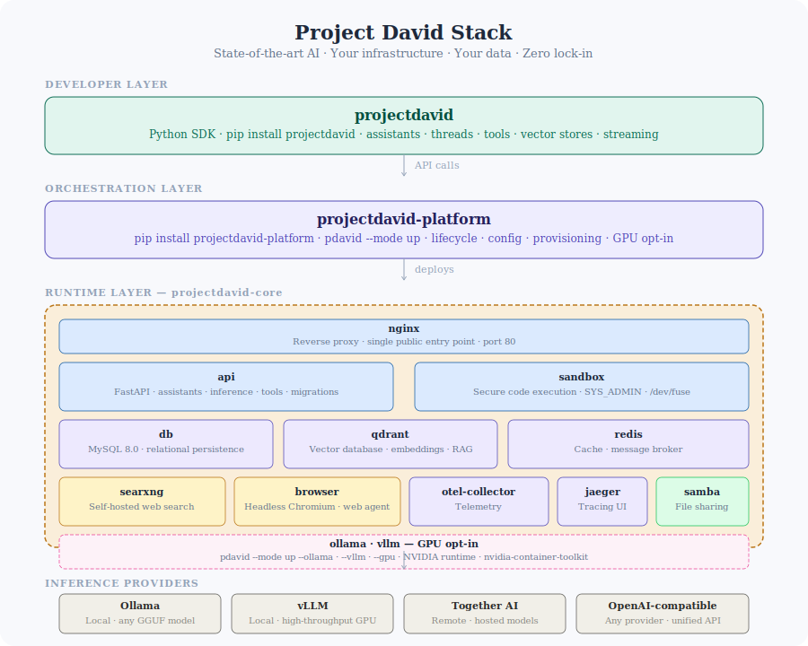

# Project David Platform

[](https://hub.docker.com/r/thanosprime/entities-api-api)
[](https://github.com/project-david-ai/platform-docker/actions/workflows/ci.yml)
[](https://pypi.org/project/projectdavid-platform/)
[](https://polyformproject.org/licenses/noncommercial/1.0.0/)

The projectdavid-platform API provides a simple, self-hosted interface for state-of-the-art AI — assistants, agents, RAG pipelines, and code execution — with full parity to the OpenAI Assistants API across heterogeneous inference providers.
Connect any model, anywhere. Run inference locally via Ollama or vLLM, or route to remote providers like Together AI — all through a single unified API. Switch providers without changing your application code.
Get started by installing the platform and creating your first API key. Discover how to build assistants, run code, search the web, query vector stores, and orchestrate multi-step agent workflows.
State-of-the-art AI. Your infrastructure. Your data.

---

## Installation

```bash
pip install projectdavid-platform
```

No repository clone required. The compose files and configuration templates are bundled with the package.

> **Windows users:** pip installs the `pdavid` command to a Scripts directory that is not on PATH by default. If `pdavid` is not found after installation, add the following to your PATH:
>
> ```
> C:\Users\<your-username>\AppData\Roaming\Python\Python3XX\Scripts
> ```
>
> Replace `Python3XX` with your Python version (e.g. `Python313`). On Linux and macOS this is handled automatically.

---

## Quick Start

```bash
pdavid --mode up
```

On first run this will:

- Generate a `.env` file with unique, cryptographically secure secrets
- Prompt for optional values (HuggingFace token for gated model access)
- Pull all required Docker images
- Start the full stack in detached mode

### GPU stack (vLLM + Ollama)

```bash
pdavid --mode up --gpu
```

Requires an NVIDIA GPU with the [NVIDIA Container Toolkit](https://docs.nvidia.com/datacenter/cloud-native/container-toolkit/install-guide.html) installed.


---

## Stack Services





| Service | Image | Description |
|---|---|---|
| `api` | `thanosprime/entities-api-api` | FastAPI backend exposing assistant and inference endpoints |
| `sandbox` | `thanosprime/entities-api-sandbox` | Secure code execution environment |
| `db` | `mysql:8.0` | Relational persistence |
| `qdrant` | `qdrant/qdrant` | Vector database for embeddings and RAG |
| `redis` | `redis:7` | Cache and message broker |
| `searxng` | `searxng/searxng` | Self-hosted web search |
| `browser` | `browserless/chromium` | Headless browser for web agent tooling |
| `otel-collector` | `otel/opentelemetry-collector-contrib` | Telemetry collection |
| `jaeger` | `jaegertracing/all-in-one` | Distributed tracing UI |
| `samba` | `dperson/samba` | File sharing for uploaded documents |
| `ollama` | `ollama/ollama` | Local LLM inference (GPU stack only) |
| `vllm` | `vllm/vllm-openai` | High-throughput GPU inference (GPU stack only) |

---

# System Requirements

## Services

| Service | Image | Resource needs | Network |
|---|---|---|---|
| **MySQL (db)** — Database | `mysql:8.0` | 2+ CPU cores, 2GB+ RAM. Persistent volume (`mysql_data`) | Internal + port 3307 (local tooling only via `SPECIAL_DB_URL`) |
| **Qdrant** — Vector store | `qdrant/qdrant:latest` | 1+ CPU, 2GB+ RAM. Persistent volume (`qdrant_storage`) | Internal only |
| **Redis** — Cache / queue | `redis:7` | 512MB+ RAM. Persistent volume (`redis_data`) | Internal only |
| **Browserless / Chromium** — Web agent browser | `ghcr.io/browserless/chromium:latest` | 2+ CPU, 1GB+ RAM per session. Up to 10 concurrent sessions | Internal only |
| **SearXNG** — Web search engine | `searxng/searxng:latest` | 512MB+ RAM. Depends on Redis | Internal only |
| **OTEL Collector** — Observability | `otel/opentelemetry-collector-contrib:latest` | 256MB+ RAM. Depends on Jaeger | Internal only |
| **Jaeger** — Trace UI | `jaegertracing/all-in-one:latest` | 512MB+ RAM. No persistent volume needed | Internal only |
| **Ollama** — Local LLM inference | `ollama/ollama:latest` | 4GB+ RAM, 8GB+ for 7B models. Persistent volume (`ollama_data`) | Internal only |
| **vLLM** — GPU LLM inference *(optional)* | `vllm/vllm-openai:latest` | Nvidia GPU required. `nvidia-container-toolkit` on host. 8GB+ VRAM (16GB+ recommended) | Internal only. `runtime: nvidia` |
| **FastAPI (api)** — Core orchestration API | `thanosprime/entities-api-api:latest` | 2+ CPU, 2GB+ RAM. Depends on all services | Internal only — exposed via Nginx |
| **Sandbox** — Code execution | `thanosprime/entities-api-sandbox:latest` | 2+ CPU, 1GB+ RAM. Requires `SYS_ADMIN` + `/dev/fuse`. `seccomp:unconfined` | Internal only |
| **Samba** — File share | `dperson/samba` | 256MB+ RAM. Shared path volume mount | Internal only |
| **Nginx** — Reverse proxy | `nginx:alpine` | 128MB+ RAM. Config at `docker/nginx/nginx.conf` | Port 80 (443 when TLS ready). Single public entry point |

---

## Minimum Host Requirements

| Resource | Minimum | Notes |
|---|---|---|
| CPU | 4 cores | 8+ cores recommended |
| RAM | 16GB | 32GB+ if running vLLM |
| Disk | 50GB free | SSD recommended. Ollama model storage can grow large |
| GPU | — | Nvidia GPU with 8GB+ VRAM, optional, required only for vLLM |

---

## Runtime Dependencies

- Docker Engine 24+
- Docker Compose v2+
- `nvidia-container-toolkit` — only required if using vLLM
- `/dev/fuse` available on host — required by the sandbox container

---

## Notes

- **vLLM is optional.** Without an Nvidia GPU and `nvidia-container-toolkit`, exclude it at startup: `pdavid --mode up --exclude vllm --exclude ollama`
- **Sandbox requires elevated host privileges.** The sandbox container needs `SYS_ADMIN`, `/dev/fuse`, and `seccomp:unconfined`. It will not run on locked-down hosts or most managed container platforms (AWS ECS, Google Cloud Run, etc.) without special configuration.
- **MySQL port 3307** is exposed on the host for local tooling only (e.g. DBeaver, DataGrip via `SPECIAL_DB_URL`). Remove this binding in production.
- **All other services are internal only.** No ports are exposed except Nginx (80/443). The API, sandbox, Samba, Redis, Qdrant, Ollama, and vLLM are only reachable within the `my_custom_network` Docker bridge network.

---

## Prerequisites

- Docker and Docker Compose
- Python 3.9 or later
- NVIDIA GPU with NVIDIA Container Toolkit (GPU stack only)

---

## Lifecycle Commands

### Start the stack

```bash
pdavid --mode up
```

### Start with GPU services

```bash
pdavid --mode up --gpu
```

### Stop the stack

```bash
pdavid --mode down_only
```

### Stop and remove all volumes

```bash
pdavid --mode down_only --clear-volumes
```

### Force recreate all containers

```bash
pdavid --mode up --force-recreate
```

### Stream logs

```bash
pdavid --mode logs --follow
```

### Destroy all stack data

```bash
pdavid --nuke
```

Requires interactive confirmation. Cannot be undone.

---

## Configuration

### Setting optional values

Optional values such as the HuggingFace token can be set at any time without regenerating secrets:

```bash
pdavid configure --set HF_TOKEN=hf_abc123
pdavid configure --set VLLM_MODEL=Qwen/Qwen2.5-VL-7B-Instruct
```

Or interactively:

```bash
pdavid configure --interactive
```

### Rotating secrets

The orchestrator warns when a change requires additional steps to apply safely. Database password rotation requires clearing the initialised volume:

```bash
pdavid configure --set MYSQL_PASSWORD=<new_password>
# Follow the warning instructions printed by the command
```

---

## Post-startup Provisioning

Once the stack is running, provision the admin user and default assistant:

```bash
# Bootstrap the default admin user
pdavid bootstrap-admin

# Create a regular user
pdavid create-user --email user@example.com --name "Alice"

# Set up the default assistant
pdavid setup-assistant --api-key ad_... --user-id usr_...
```

Full documentation [here](https://github.com/project-david-ai/projectdavid_docs/blob/master/src/pages/projectdavid-platform/projectdavid-platform-commands.md)

---

## Docker Images

Both owned images are published to Docker Hub and updated automatically on each release of the source repository.

- [thanosprime/entities-api-api](https://hub.docker.com/r/thanosprime/entities-api-api)
- [thanosprime/entities-api-sandbox](https://hub.docker.com/r/thanosprime/entities-api-sandbox)

---

## Related Repositories

| Repository | Purpose |
|---|---|
| [platform](https://github.com/project-david-ai/platform) | The source code of this package |
| [projectdavid](https://github.com/project-david-ai/projectdavid) | Python SDK for programmatic interaction with this API — **start here** |
| [reference-backend](https://github.com/project-david-ai/reference-backend) | Reference backend application |
| [reference-frontend](https://github.com/project-david-ai/reference-frontend) | Reference frontend application |

---

## Working with the Source Code

This repository is intended for deploying prebuilt images. To develop, extend, or contribute to the platform source:

```bash
git clone https://github.com/project-david-ai/platform
pip install -e .
```

Avoid mixing environments.

---

## Client Operations

Platform hosts over 80 API endpoints managing the lifecycle of basic to advanced LLM inference workflows.

It is recommended to use the [projectdavid](https://github.com/project-david-ai/projectdavid) Python SDK to interact with the API.

## Your Architecture

Do not use the API as your backend directly.

A typical design follows a three-tier architecture:

- `projectdavid-platform` is your inference orchestrator, equivalent to OpenAI's Assistants API
- Your backend
- Your frontend

See the [reference backend](https://github.com/project-david-ai/reference-backend) and [reference frontend](https://github.com/project-david-ai/reference-frontend) for starting points.

## The SDK

```bash
pip install projectdavid
```

With integrated vector store pipeline (RAG):

```bash
pip install projectdavid[embeddings]
```

- [Quick start guide](https://github.com/project-david-ai/projectdavid_docs/blob/master/src/pages/sdk/sdk-quick-start.md)
- [Complete SDK documentation](https://github.com/project-david-ai/projectdavid_docs/tree/master/src/pages/sdk)

---

## A Quick Note on Privacy

**No data or telemetry leaves the stack except in the following cases:**

1. You choose to use an external inference endpoint (e.g. `together-ai/Qwen/Qwen2.5-72B-Instruct`)
2. Your AI assistant calls the web search or deep research platform tools at runtime
3. One of your own tools calls an external API
4. You load an image from an external URL when using a vision model

**Your instance of this stack is unique, with unique secrets. We cannot see your conversations, data, or secrets.**

---

## License

Distributed under the [PolyForm Noncommercial License 1.0.0](https://polyformproject.org/licenses/noncommercial/1.0.0/).
Commercial licensing is available on request.